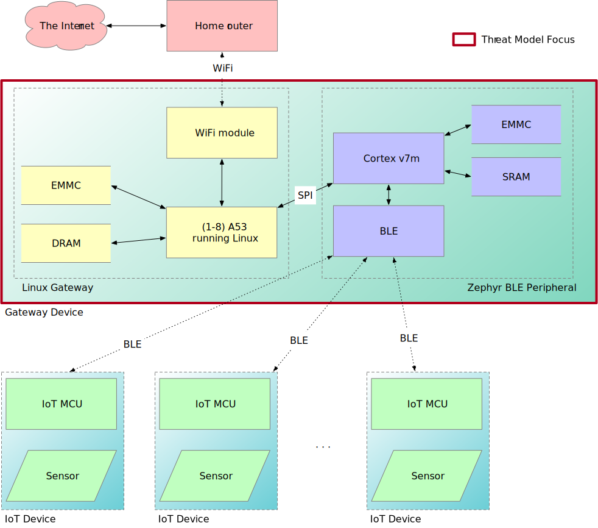

# Threat model for gateway

## Overview

This document describes a threat model for an IoT gateway device.
This device bridges between a series of IoT devices on a BLE mesh
network to the great internet.

This figure shows the gateway device, and how it is connected.  The
scope of this document is the device contained within the red box.

This system consists of an ARM-based Linux system running, using EMMC
and DRAM.  The system contains a WiFi module that connects to the
user's home network.  In addition, there is a BLE peripheral that
consists of a Cortex v7m MCU that implements the BLE protocol and
communicates with the Linux device over an SPI bus.

The IoT Devices are covered in the [Sensor](sensor.md) document.
For the purposes of this document, the Internet will be considered
adversarial, and configuration of the Home Router is beyond the scope
of this document.  As such, all traffic over the WiFi will be
considered adversarial.  It is still advisable that the user configure
their router as a firewall to prevent unexpected traffic from reaching
the gateway device.

- BLE peripheral.  From the perspective of Linux, the BLE peripheral
  behaves like another typical peripheral.  However, it is possible to
  update the firmware in this peripheral, which opens this up as an
  attack vector.  This BLE peripheral is connected to the Linux CPU
  via SPI.

- The WiFi module is also likely an MCU running firmware for this
  purpose.  However, WiFi modules are a more mature space and are
  likely to have already had threat analysis performed on them.

- The Linux system runs code out of DRAM and uses the EMMC device for
  boot and as a filesystem.  There are numerous configurations for a
  Linux device such as this, from a pre-built image such as
  OpenEmbedded, to a regular distro, such as Debian or Ubuntu.  In
  each case, we will need to consider how the system is kept up to
  date, and the types of attacks it is susceptible to.
